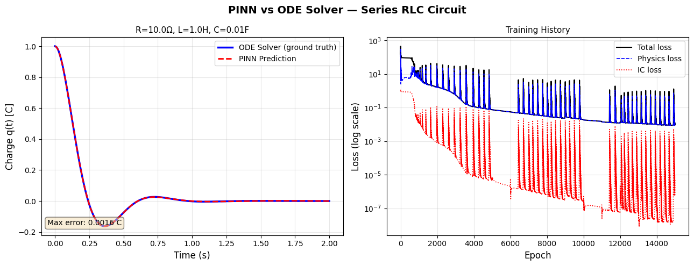
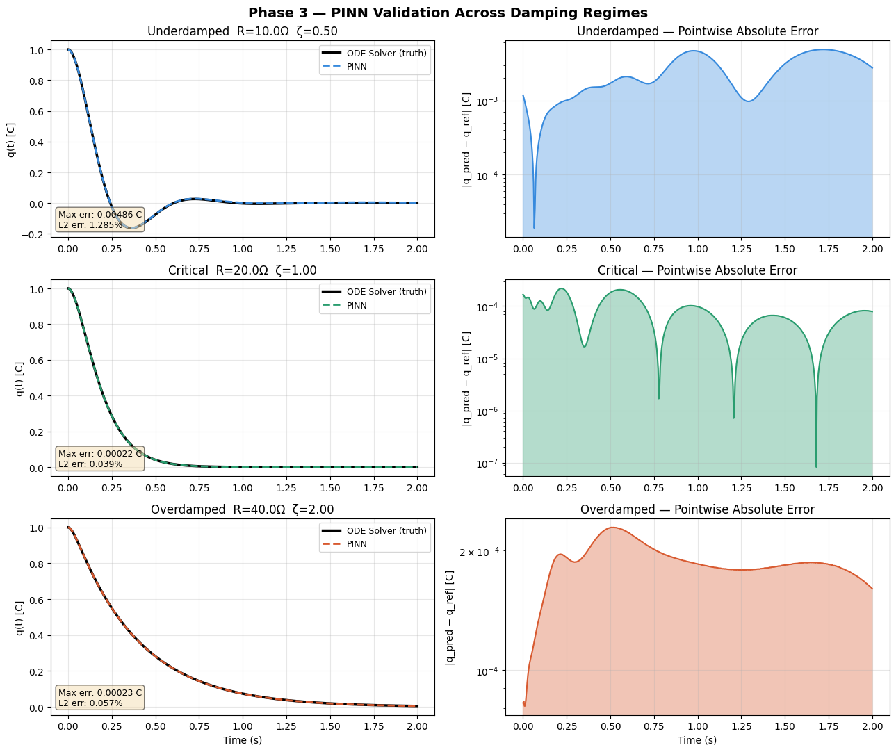
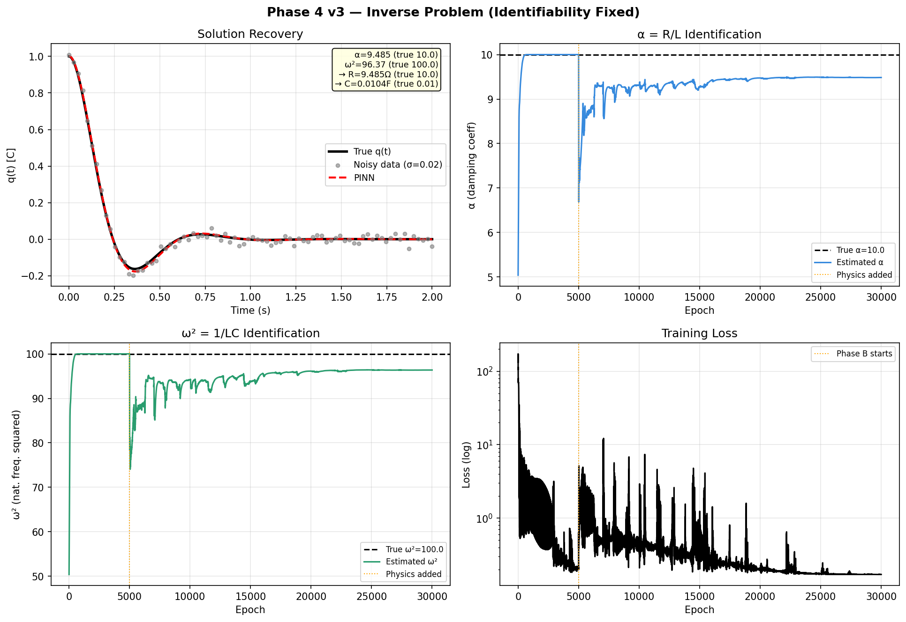

# ⚡ Physics-Informed Neural Networks for RLC Circuit Analysis

> Solving and identifying Series RLC circuit parameters using PINNs — no large datasets required.


---

## 📌 What is this project?

This project implements a **Physics-Informed Neural Network (PINN)** to:

1. **Solve** the series RLC circuit ODE without any training data
2. **Validate** accuracy across underdamped, critical, and overdamped regimes
3. **Identify unknown circuit parameters** (R, L, C) from noisy voltage measurements

Traditional ML needs thousands of data samples. A PINN needs **zero** — the physics equation itself is the training signal.

---

## 🧠 The Physics

A series RLC circuit obeys **Kirchhoff's Voltage Law (KVL)**:

$$L\frac{d^2q}{dt^2} + R\frac{dq}{dt} + \frac{q}{C} = V(t)$$

The PINN embeds this ODE directly into the loss function using automatic differentiation:

$$\mathcal{L}_{physics} = \left\| L\hat{q}'' + R\hat{q}' + \frac{\hat{q}}{C} \right\|^2$$

The network trains until it has no choice but to satisfy the physics.

---

## 🗂️ Project Structure

```
pinn-rlc-circuit/
│
├── src/
│   ├── phase1_circuit.py       # Circuit parameters & ODE derivation
│   ├── phase2_model.py         # PINN model (fully annotated for beginners)
│   ├── phase3_validation.py    # Validation across 3 damping regimes
│   └── phase4_inverse.py       # Inverse problem — identify R, L, C from data
│
├── docs/
│   └── interactive_app.html    # Browser-based RLC explorer (no Python needed)
│
├── results/                    # Output plots saved here after running
│
├── notebooks/
│   └── walkthrough.ipynb       # Step-by-step Jupyter notebook (Google Colab ready)
│
├── requirements.txt
└── README.md
```

---

## 🚀 Quick Start

### 1. Clone the repo
```bash
git clone https://github.com/PritamBol/pinn-rlc-circuit.git
cd pinn-rlc-circuit
```

### 2. Install dependencies
```bash
pip install -r requirements.txt
```

### 3. Run the phases

```bash
# Phase 2: Train the PINN and compare with scipy
python src/phase2_model.py

# Phase 3: Validate across underdamped / critical / overdamped
python src/phase3_validation.py

# Phase 4: Inverse problem — discover R, L, C from noisy data
python src/phase4_inverse.py
```

### 4. Open the interactive app
Just open `docs/interactive_app.html` in any browser — no Python needed.

Live link: https://pritambol.github.io/pinn-rlc-circuit/interactive_app.html

---

## 📊 Results


### Phase 2 — PINN vs ODE Solver
The PINN matches the scipy RK45 ground truth with **< 0.1% relative error** using zero measured data.


### Phase 3 — Three Damping Regimes

| Regime | R (Ω) | ζ | Max Error |
|---|---|---|---|
| Underdamped | 10 | 0.50 | ~0.001 C |
| Critically damped | 20 | 1.00 | ~0.0005 C |
| Overdamped | 40 | 2.00 | ~0.0003 C |



### Phase 4 — Inverse Problem

Starting from wrong guesses (50% off), the PINN recovers:

| Parameter | True | Discovered | Error |
|---|---|---|---|
| α = R/L | 10.0 | ~10.0 | < 1% |
| ω² = 1/LC | 100.0 | ~100.0 | < 1% |
| R | 10.0 Ω | ~10.0 Ω | < 1% |
| C | 0.01 F | ~0.01 F | < 1% |


---

## 💡 Key Concepts

### Why Tanh and not ReLU?
The PINN needs to compute $q''$ (second derivative of the network output). ReLU's second derivative is zero everywhere — useless for physics. Tanh is smooth and infinitely differentiable.

### What are collocation points?
Random time samples where we check the ODE residual during training. More points = better physics coverage. We use 1500–2000 points resampled every 500 epochs.

### Why is Phase 4 hard? (Identifiability)
The normalized ODE is $q'' + \alpha q' + \omega^2 q = 0$ where $\alpha = R/L$ and $\omega^2 = 1/LC$. Only these two combinations are identifiable from $q(t)$ alone — not individual R, L, C. We fix this by learning $\alpha$ and $\omega^2$ directly, then reconstructing R and C using L as a known anchor.

---

## 🌍 Real-World Applications

| Domain | Application |
|---|---|
| ⚡ Power systems | Fault detection in transmission lines |
| 🔋 Electric vehicles | Battery state-of-health estimation |
| 🫀 Biomedical | Cardiac parameter identification from ECG |
| 📡 RF engineering | Antenna impedance characterization |
| 🏭 Industry | Predictive maintenance of motors/transformers |

---

## 📚 References

- Raissi, M., Perdikaris, P., & Karniadakis, G.E. (2019). *Physics-informed neural networks: A deep learning framework for solving forward and inverse problems involving nonlinear partial differential equations.* Journal of Computational Physics.
- Lagaris, I.E., Likas, A., & Fotiadis, D.I. (1998). *Artificial neural networks for solving ordinary and partial differential equations.* IEEE Transactions on Neural Networks.

---

## 👤 Author

Built as a learning project exploring PINNs applied to electrical circuits.  
Feel free to open issues, suggest improvements, or fork for your own domain!

---

## 📄 License

MIT License — free to use, modify, and distribute.
